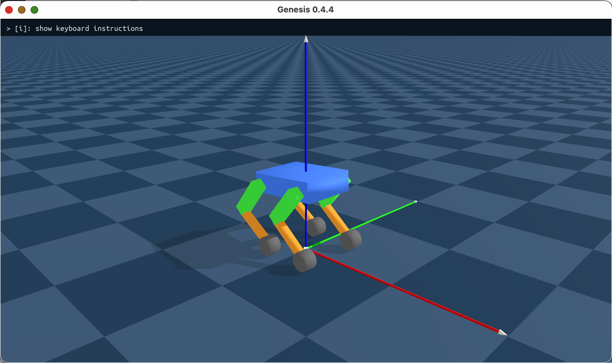

# gdog sim



A minimal wheeled quadruped robot simulation using the [Genesis](https://github.com/Genesis-Embodied-AI/Genesis) physics engine. This simulator is explicitly optimized for Apple Silicon (such as the M1 MacBook Air), utilizing the Metal backend for fast, hardware-accelerated physics and rendering.

## Features
- **Custom Quadruped URDF**: Features a procedural 4-legged robot (`simple_robot.urdf`) with a central chassis and independent 2-segment legs (thighs and calves) marked in contrasting colors.
- **Active Pose Control**: The simulation automatically actuates the joints to hold a Z-fold standing posture (hips at 45°, knees at -90°).
- **Apple Silicon (M1) Optimizations**: 
  - Hardcoded internal 1080p rendering resolution to decouple from demanding Retina fullscreen constraints.
  - Disabled plane reflections to save raw GPU power and keep framerates well above 120 FPS.
  - Increased ambient lighting for better visibility on macOS displays.
- **Remote Control Server**:
  - FastAPI server on port 8000
  - WebSocket endpoint at `/ws`
  - Optional WebRTC offer endpoint at `/offer`
  - Capability endpoint at `/capabilities`

## Installation

Make sure your Python virtual environment is active.

```bash
python3 -m venv .venv
source .venv/bin/activate

# Install the core requirements:
pip install -r requirements.txt

# You also need to manually install PyTorch for the Genesis engine tensor ops:
pip install torch

# Optional: enable WebRTC transport
pip install -r requirements-webrtc-optional.txt
```

## Usage

The `main.py` script offers two distinct modes for observing the physics simulation:

**1. Interactive Viewer (GUI)**
Opens a floatable 1080p high-performance real-time 3D window.
```bash
python main.py --render
```

**2. Headless Video Render**
Steps the physics engine without launching a UI window and saves the results to `wheeled_go2.mp4`.
```bash
python main.py --video
```

## Run With Web Controller

Run the simulator and the remote app in two terminals.

1. Terminal A in this repository:

```bash
source .venv/bin/activate
python main.py --render
```

2. Terminal B in the sibling `gdog-remote` repository:

```bash
npm install
npm run dev
```

3. Open the frontend URL shown by Vite, usually `http://localhost:5173`

## Transport Behavior

- WebSocket is the default reliable path
- WebRTC is optional and requires `aiortc`
- Frontend probes `/capabilities` and enables WebRTC only when available

## Troubleshooting

- Frontend runs but controls do nothing:
  - Check this process is running and prints websocket client connection logs
  - Verify backend responds at `http://localhost:8000/capabilities`
- WebRTC connect fails:
  - Install `aiortc` via `pip install -r requirements-webrtc-optional.txt`
  - Restart simulator
- Import errors on startup:
  - Ensure `.venv` is active
  - Reinstall with `pip install -r requirements.txt`
